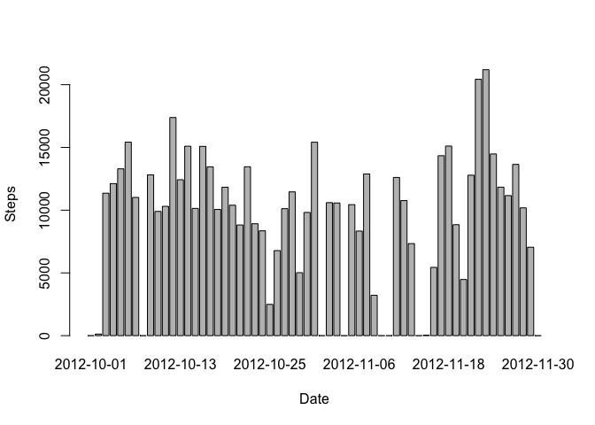
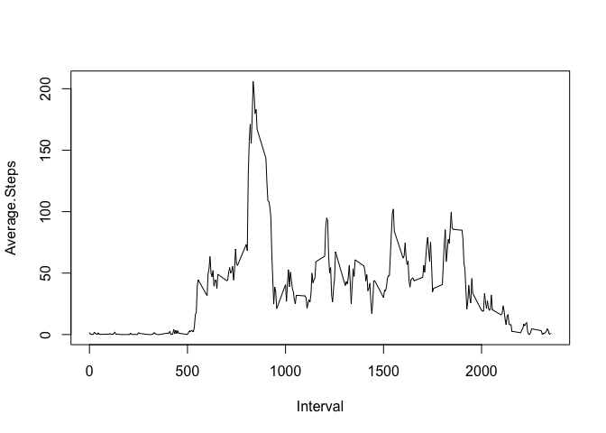
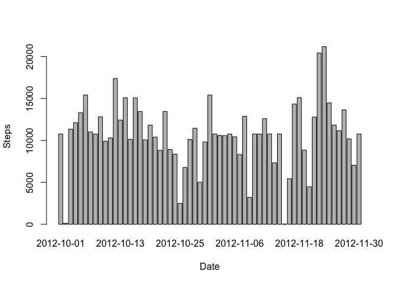
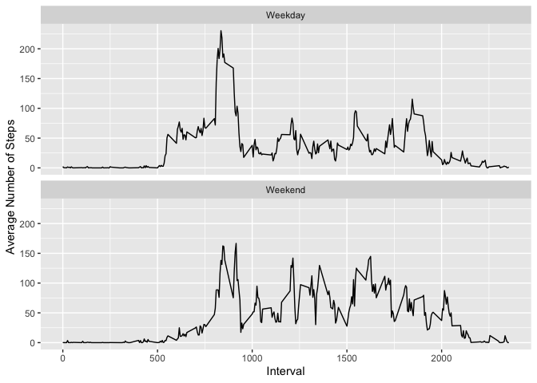

## Loading and preprocessing the data

```r
act <- read.csv("activity.csv")
```

## What is mean total number of steps taken per day?
Let's first calculate the total number of steps taken per day and plot this total number of steps per each day.  

```r
s1 <- with(act, tapply(steps, date, sum, na.rm = TRUE))
d1 <- data.frame(Date = as.Date(names(s1)), Steps = s1)
barplot(Steps ~ Date, d1)
```

<!-- -->

Now calculate and report the mean and median of the total number of the steps per day.  

```r
dmean <- mean(d1$Steps)
dmedian <- median(d1$Steps)
```
Mean: 9354.23  
Median: 10395

## What is the average daily activity pattern?
Let's make a time series plot of the 5-minute interval (x-axis) and the average number of steps taken, averaged across all days (y-axis)

```r
s2 <- with(act, tapply(steps, interval, mean, na.rm = TRUE))
d2 <- data.frame(Interval = names(s2), Average.Steps = s2)
with(d2, plot(Interval, Average.Steps, type = "l"))
```

<!-- -->

Which 5-minute interval, on average across all the days in the dataset, contains the maximum number of steps?  

```r
max_step <- d2[which.max(d2$Average.Steps), ]
```
It's the 835 5-minute interval which has maximum average step 206.1698113.

## Imputing missing values
Calculate and report the total number of missing values in the dataset (i.e. the total number of rows with NA)

```r
nas <- is.na(act$steps)
```
There are 2304 missing values in steps of the dataset.

Devise a strategy to impute the missing value. Here we use the mean for that 5-minute interval to impute the missing values.  
Create a new dataset that is equal to the original dataset but with the missing data filled in.

```r
library(plyr)
missing <- act[nas, ]
d3 <- data.frame(d2)
names(d3) <- c("interval", "avg.steps")
missing_imputed <- join(missing, d3, by = "interval")
act_imputed <- data.frame(act)
act_imputed[nas,]$steps <- missing_imputed$avg.steps
```

plot the imputed data and report the mean and median for the total number of steps per day.  
Do these values differ from the estimates from the first part of the assignment?  
What is the impact of imputing missing data on the estimates of the total daily number of steps?

```r
s4 <- with(act_imputed, tapply(steps, date, sum))
d4 <- data.frame(Date = as.Date(names(s4)), Steps = s4)
barplot(Steps ~ Date, d4)
```

<!-- -->

```r
mean4 <- mean(d4$Steps)
median4 <- median(d4$Steps)
```

Mean: 10766.19  
Median: 10766.19  
It's different from the first plot, but the impact is not large.

## Are there differences in activity patterns between weekdays and weekends?
Create a new factor variable in the dataset with two levels – “weekday” and “weekend” indicating whether a given date is a weekday or weekend day.

```r
act_imputed$date <- as.Date(act_imputed$date)
wd <- weekdays(act_imputed$date)
f <- as.factor(wd %in% c("Saturday", "Sunday"))
levels(f) <- c("Weekday", "Weekend")
act_imputed$weekday <- f
```

Make a panel plot containing a time series plot of the 5-minute interval (x-axis) and the average number of steps taken, averaged across all weekday days or weekend days (y-axis). 

```r
weekday_steps <- with(act_imputed[act_imputed$weekday == "Weekday",], tapply(steps, interval, mean))
weekday_steps <- data.frame(Interval = names(weekday_steps), Steps = weekday_steps, Weekday = "Weekday")
weekend_steps <- with(act_imputed[act_imputed$weekday == "Weekend",], tapply(steps, interval, mean))
weekend_steps <- data.frame(Interval = names(weekend_steps), Steps = weekend_steps, Weekday = "Weekend")

par(mfrow = c(2,1))
with(weekday_steps, plot(Interval, Steps, type="l", main = "Weekend Steps"))
with(weekend_steps, plot(Interval, Steps, type="l", main = "Weekday Steps"))
```

<!-- -->
