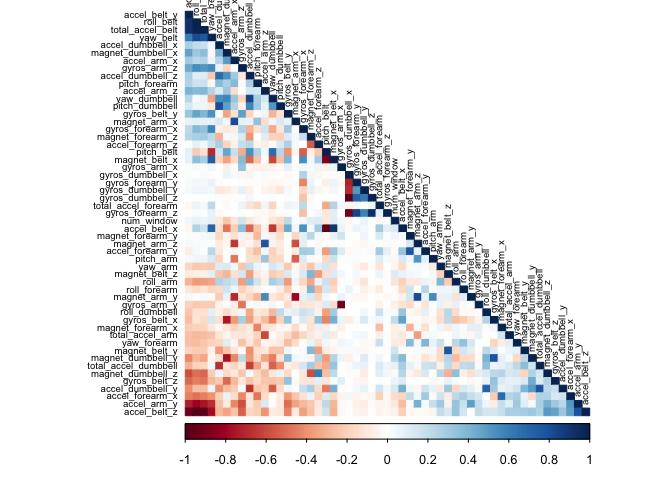

## Overview
Using devices such as Jawbone Up, Nike FuelBand, and Fitbit it is now possible to collect a large amount of data about personal activity relatively inexpensively. These type of devices are part of the quantified self movement – a group of enthusiasts who take measurements about themselves regularly to improve their health, to find patterns in their behavior, or because they are tech geeks. One thing that people regularly do is quantify how much of a particular activity they do, but they rarely quantify how well they do it. In this project, your goal will be to use data from accelerometers on the belt, forearm, arm, and dumbell of 6 participants. They were asked to perform barbell lifts correctly and incorrectly in 5 different ways.  

The goal of the project is to predict the manner in which they did the exercise. This is the "classe" variable in the training set. The [training](https://d396qusza40orc.cloudfront.net/predmachlearn/pml-training.csv) and [testing](https://d396qusza40orc.cloudfront.net/predmachlearn/pml-testing.csv) data for this project are available here for download.

## Exploratory Data Analysis and Cleaning 
After importing the training data set, we find there are 160 variables, but a lots of them have plenty of NA. We can use the Near Zero Variance method to remove those variables.


```r
training <- read.csv("pml-training.csv")
dim(training)
```

```
## [1] 19622   160
```

```r
# remove variables with Nearly Zero Variance
NZV <- nearZeroVar(training)
training <- training[, -NZV]
dim(training)
```

```
## [1] 19622   100
```

We also remove the variables that are mostly NAs. 

```r
# remove variables that are mostly NA
MOSTNA <- sapply(training, function(x) mean(is.na(x)) > 0.95)
training <- training[, MOSTNA==FALSE]
dim(training)
```

```
## [1] 19622    59
```

Finally we remove the identification and time variables from column 1 to 5.

```r
# remove identification only variables (columns 1 to 5)
training <- training[, -(1:5)]
dim(training)
```

```
## [1] 19622    54
```

A correlation among variables is analyzed before proceeding to the modeling procedures. And highly correlated variables are shown in dark colors, and we also find them as listed. 

```r
corMatrix <- cor(training[, -54])
corrplot(corMatrix, order = "FPC", method = "color", type = "lower", tl.cex = 0.6, tl.col = rgb(0, 0, 0))
```

<!-- -->

```r
highlyCorrelated = findCorrelation(corMatrix, cutoff=0.75)
names(training)[highlyCorrelated]
```

```
##  [1] "accel_belt_z"      "roll_belt"         "accel_belt_y"     
##  [4] "accel_arm_y"       "total_accel_belt"  "accel_dumbbell_z" 
##  [7] "accel_belt_x"      "pitch_belt"        "magnet_dumbbell_x"
## [10] "accel_dumbbell_y"  "magnet_dumbbell_y" "accel_arm_x"      
## [13] "accel_dumbbell_x"  "accel_arm_z"       "magnet_arm_y"     
## [16] "magnet_belt_z"     "accel_forearm_y"   "gyros_dumbbell_x" 
## [19] "gyros_forearm_y"   "gyros_dumbbell_z"  "gyros_arm_x"
```

To make an even more compact analysis, a PCA (Principal Components Analysis) could be performed as pre-processing step to the datasets. Nevertheless, as the correlations are quite few (53), this step will not be applied for this assignment.

## Model Selections
First, lets split the original training data set to training and test data set for model building. Treat the original testing data as validation set.

```r
inTrain  <- createDataPartition(training$classe, p=0.7, list=FALSE)
trainSet <- training[inTrain, ]
testSet  <- training[-inTrain, ]
dim(trainSet)
```

```
## [1] 13737    54
```

### Classification Tree
The first model we will try is a classification tree. Then we predict it against our test data set, it shows that the accuracy is around 73% (aka, out-of-sample error rate 27%). 

```r
mCT <- rpart(classe ~ ., data=trainSet, method="class")
# prediction on Test dataset
predictCF <- predict(mCT, newdata=testSet, type="class")
confusionMatrix(predictCF, as.factor(testSet$classe))
```

```
## Confusion Matrix and Statistics
## 
##           Reference
## Prediction    A    B    C    D    E
##          A 1502  201   59   66   74
##          B   58  660   37   64  114
##          C    4   66  815  129   72
##          D   90  148   54  648  126
##          E   20   64   61   57  696
## 
## Overall Statistics
##                                           
##                Accuracy : 0.7342          
##                  95% CI : (0.7228, 0.7455)
##     No Information Rate : 0.2845          
##     P-Value [Acc > NIR] : < 2.2e-16       
##                                           
##                   Kappa : 0.6625          
##                                           
##  Mcnemar's Test P-Value : < 2.2e-16       
## 
## Statistics by Class:
## 
##                      Class: A Class: B Class: C Class: D Class: E
## Sensitivity            0.8973   0.5795   0.7943   0.6722   0.6433
## Specificity            0.9050   0.9425   0.9442   0.9151   0.9579
## Pos Pred Value         0.7897   0.7074   0.7505   0.6079   0.7751
## Neg Pred Value         0.9568   0.9033   0.9560   0.9344   0.9226
## Prevalence             0.2845   0.1935   0.1743   0.1638   0.1839
## Detection Rate         0.2552   0.1121   0.1385   0.1101   0.1183
## Detection Prevalence   0.3232   0.1585   0.1845   0.1811   0.1526
## Balanced Accuracy      0.9011   0.7610   0.8693   0.7936   0.8006
```

### Random Forest
Now we try a random forest model with 3 folds cross validation. This time the accuracy against the test data set is around 99% (aka, out of sample error rate 1%), which is extremely high. And we will choose this model as our final model.

```r
# 3 fold cross validation random forest
controlRF <- trainControl(method="cv", number=3, verboseIter=FALSE)
mRF <- train(classe ~ ., data=trainSet, method="rf", trControl=controlRF)
mRF$finalModel
```

```
## 
## Call:
##  randomForest(x = x, y = y, mtry = param$mtry) 
##                Type of random forest: classification
##                      Number of trees: 500
## No. of variables tried at each split: 27
## 
##         OOB estimate of  error rate: 0.18%
## Confusion matrix:
##      A    B    C    D    E  class.error
## A 3904    1    0    0    1 0.0005120328
## B    4 2650    3    1    0 0.0030097818
## C    0    5 2391    0    0 0.0020868114
## D    0    0    8 2244    0 0.0035523979
## E    0    0    0    2 2523 0.0007920792
```

```r
# prediction on Test dataset
predictRF <- predict(mRF, newdata=testSet)
confusionMatrix(predictRF, as.factor(testSet$classe))
```

```
## Confusion Matrix and Statistics
## 
##           Reference
## Prediction    A    B    C    D    E
##          A 1674    1    0    0    0
##          B    0 1138    2    0    0
##          C    0    0 1024    2    0
##          D    0    0    0  962    1
##          E    0    0    0    0 1081
## 
## Overall Statistics
##                                           
##                Accuracy : 0.999           
##                  95% CI : (0.9978, 0.9996)
##     No Information Rate : 0.2845          
##     P-Value [Acc > NIR] : < 2.2e-16       
##                                           
##                   Kappa : 0.9987          
##                                           
##  Mcnemar's Test P-Value : NA              
## 
## Statistics by Class:
## 
##                      Class: A Class: B Class: C Class: D Class: E
## Sensitivity            1.0000   0.9991   0.9981   0.9979   0.9991
## Specificity            0.9998   0.9996   0.9996   0.9998   1.0000
## Pos Pred Value         0.9994   0.9982   0.9981   0.9990   1.0000
## Neg Pred Value         1.0000   0.9998   0.9996   0.9996   0.9998
## Prevalence             0.2845   0.1935   0.1743   0.1638   0.1839
## Detection Rate         0.2845   0.1934   0.1740   0.1635   0.1837
## Detection Prevalence   0.2846   0.1937   0.1743   0.1636   0.1837
## Balanced Accuracy      0.9999   0.9994   0.9988   0.9989   0.9995
```

## Predict Against the Validation Data Set
Now we apply the random forest model to the orignal test data set. And below code snippet shows the prediction result.

```r
testing <- read.csv("pml-testing.csv")
predictTEST <- predict(mRF, newdata=testing)
predictTEST
```

```
##  [1] B A B A A E D B A A B C B A E E A B B B
## Levels: A B C D E
```
